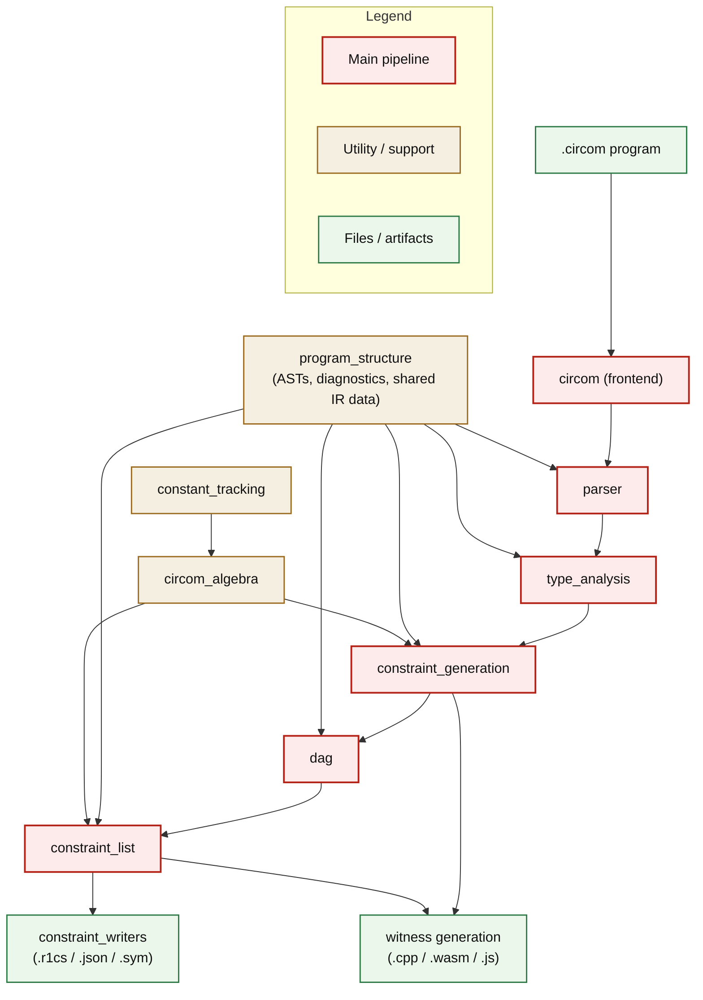
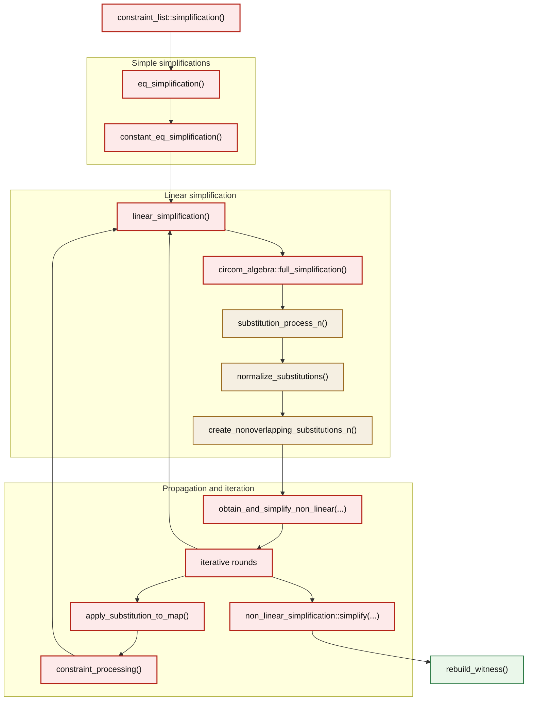

# Coverage & Codebase Architecture Report

This document gives a overview of the Circom codebase and explains how the constraint optimisation pipeline looks like. Then it briefly investigates the poor coverage from Circom's test suite, and then compares differential coverage between `picus-fusion` (the `smt-solver` fusion experiment run with picus oracle) and `circuzz-arithmetic` (the original circuzz pipeline and oracle).

`circuzz-arithmetic` covers more than `picus-fusion` across the differential results, and the differential section investigates why and where.

## Codebase Overview

### Directly Relevant to R1CS Generation

| Module                    | Description                                                                                                                                                                                                                                                                                                                                                            |
| ------------------------- | ---------------------------------------------------------------------------------------------------------------------------------------------------------------------------------------------------------------------------------------------------------------------------------------------------------------------------------------------------------------------- |
| **constraint_generation** | Takes the analyzed Circom program as input and executes it into instantiated compiler constraints and circuit state, with the goal of turning templates, signals, and assignments into a concrete constraint system.                                                                                                                                                   |
| **constraint_list**       | Takes the DAG-mapped, flattened constraints as input and produces a simplified flat constraint list, with the goal of rewriting substitutions and reducing the final system before export. Most of the actual constraint optimization happens here.                                                                                                                    |
| **circom_algebra**        | Symbolic math layer used by later stages for expressions, substitutions, constraints, and modular arithmetic. It provides the main simplification helpers used by `constraint_list`.                                                                                                                                                                                   |
| **dag**                   | Takes the instantiated circuit produced by constraint generation and represents it as a structured component graph, with the goal of preserving connectivity for witness bookkeeping, export, and later mapping into a flat constraint list.                                                                                                                           |
| **constant_tracking**     | Tiny constant interner used on the constraint path: it stores each distinct constant once, assigns it a stable `CID`, and lets later stages map both from constant value to ID and from ID back to the constant. It is used to build a constant table so later stages can refer to constants by a stable small integer instead of repeating the full value everywhere. |

### Other

| Module                 | Description                                                                             |
| ---------------------- | --------------------------------------------------------------------------------------- |
| **constraint_writers** | Writers for R1CS, sym, JSON, logs, and related exported artifacts.                      |
| **parser**             | Circom source parsing, include handling, and initial program construction.              |
| **type_analysis**      | Structural and semantic checks over signals, components, buses, dimensions, and scopes. |
| **program_structure**  | Shared ASTs, diagnostics, symbol metadata, and common compiler data structures.         |
| **circom** (frontend)  | Command-line frontend and top-level compiler orchestration.                             |
| **compiler** (all)     | Compiler middle-end for IR lowering, circuit design, and translation before backends.   |
| **code_producers**     | Backend C++ and WebAssembly witness code generation.                                    |

### Compiler Architecture Graph



At a high level, `circom` orchestrates the whole pipeline. `parser` and `type_analysis` build and validate the `ProgramArchive` on top of `program_structure`; `constraint_generation` then executes that analyzed program into instantiated circuit state while using `circom_algebra` and `constant_tracking` for symbolic algebra support. `constraint_list` also relies on `circom_algebra` for the main simplification machinery. From there, the circuit flows through `dag` and `constraint_list` into `constraint_writers` for R1CS-facing outputs, while both `constraint_generation` and `constraint_list` feed the bundled witness-generation side that covers the `VCP`, `compiler`, and `code_producers` stages.

### Constraint Simplification Pipeline



- `Simple simplifications`: `eq_simplification()` handles pure `signal = signal` equalities, and `constant_eq_simplification()` handles `signal = constant` equalities.
- `Linear simplification`: `linear_simplification()` groups connected linear constraints into clusters and sends each cluster into `circom_algebra::full_simplification()`. This is the main and most interesting part of the pipeline, where the non-trivial simplifications happen; it is explained in more detail in the next section.
- `Propagation and iteration`: Here we simplify the quadratic constraints by substituting the lienar cosntraints identified in the previous section and then restart the entire simplification process on new constraitns. `obtain_and_simplify_non_linear(...)` does the first full sweep over the non-linear constraints and tags or indexes them for later updates. In later rounds, `apply_substitution_to_map()` and `constraint_processing()` are used instead because they are faster: they revisit only the stored constraints affected by the new substitutions instead of visiting all non-linear constraints again.
- `Final cleanup`: `non_linear_simplification::simplify(...)` does the last non-linear cleanup, and `rebuild_witness()` repacks signal IDs after deleted and unused signals have been removed.

### Linear Simplification Details

`linear_simplification()` works on clusters of connected linear constraints. For each cluster it calls `circom_algebra::full_simplification()`, which runs:

```text
substitution_process_n() -> normalize_substitutions() -> create_nonoverlapping_substitutions_n()
```

#### `substitution_process_n()`

At the simplest level, `substitution_process_n()` does this: look at a linear constraint, choose one signal in it to eliminate, solve the constraint for that signal, record the resulting substitution, and if that clashes with an existing substitution for the same signal, merge the two definitions back into a new linear constraint and keep going.

All `substitution_process_n()` variants do the same high-level job: from a linear constraint with several eliminable signals, choose which signal to solve for and turn that choice into a substitution. The important differences are in the selection rule, in whether normalization happens immediately or is postponed, and in whether the process looks only at the current constraint or at the whole cluster. `substitution_process_1()` is the oldest retained version: it prefers a signal already marked deleted if one appears in the current constraint, and otherwise takes the largest eliminable signal. It then isolates that signal and stores the substitution already normalized, so a constraint like `x - y = 3` can immediately become `x := y + 3`. `substitution_process_2()` uses the same signal-choice rule but postpones normalization, so from `2x = y + z` it first keeps the pair “coefficient `2`, raw right-hand side `y + z`” and leaves the division to the later normalization step. Both of these retained variants mainly exist for comparison and are not part of the normal runtime path.

Worked example for `substitution_process_1()`: suppose the simplifier starts with `x - y - 3 = 0` and `2x + z - 1 = 0`. From the first constraint it can store the normalized substitution `x := y + 3`. When it later reaches the second constraint, it prefers `x` again because `x` is already marked deleted, derives a second definition for `x`, and immediately merges that clash back into a residual linear constraint over the remaining variables, here `2y + z + 5 = 0`. The process then continues on that new constraint, for example by solving it as `z := -2y - 5`. So the result is not two stored substitutions for `x`, but one canonical substitution for `x` plus a new constraint that can be simplified further.

Process 3 is the same as process 2 except for the signal-choice function: instead of preferring an already deleted signal and otherwise taking the largest eliminable one, it always takes the largest eliminable signal in the current linear constraint. Here, "largest" means the largest internal signal ID, not the largest coefficient or the most frequent signal. Process 4 is only used for mid-sized clusters, namely when the cluster has at least `350` constraints, fewer than `1,000,000` constraints, and `use_old_heuristics` is false; smaller clusters, larger clusters, and runs with old heuristics enabled all use process 3 instead. Process 4 still postpones normalization, but it tracks how often each signal appears across the whole cluster, removes uniquely occurring signals first through `treat_unique_constraint_4()`, then prefers signals with fewer total occurrences and records the elimination order for later replay. In the same example, if `x` appears in only one constraint but `y` and `z` appear in many, process 4 will try to eliminate `x` first because that is less likely to create substitutions that spread through the whole cluster. This is the first version that really tries to keep substitutions narrow and reduce later cleanup.

The short rationale about why the processes developed as they did is that 1 -> 2 was about avoiding unnecessary normalization work, and 3/4 were heuristic changes added after experiencing big space and time complexities when optimising large circuits.

#### Post-processing helpers

##### `normalize_substitutions()`

`normalize_substitutions()` rescales the collected substitutions into normalized form using batch modular inversion. The point of keeping this separate is that processes 2, 3, and 4 often delay division until they have accumulated a whole batch of substitutions. A simple example is `2x = y + z`: the substitution process can keep the coefficient `2` and the right-hand side `y + z` apart, and normalization later turns that into the standard form `x := (y + z) / 2`.

##### `create_nonoverlapping_substitutions_n()`

`create_nonoverlapping_substitutions_4()` and `create_nonoverlapping_substitutions()` rewrite substitutions so their right-hand sides no longer depend on other eliminated signals. For example, if the simplifier has `x := y + 1` and `y := z + 2`, these substitutions still overlap because `x` depends on `y`, which is itself eliminated. The non-overlapping pass rewrites them to something like `x := z + 3` and `y := z + 2`, so each substitution can be applied independently. The `_4` version performs the same cleanup but replays eliminations in the order recorded by process 4.

## Test-Suite Coverage

The current `test-suite` run covers `1,946` lines out of `29,702` executable lines (`6.6%`). Coverage is concentrated in a small part of the compiler:

| Folder              | Covered Lines | Coverage |
| ------------------- | ------------- | -------- |
| `code_producers`    | 1,466         | 49.3%    |
| `circom_algebra`    | 371           | 19.4%    |
| `program_structure` | 109           | 3.7%     |

## Differential Coverage: picus-fusion vs circuzz-arithmetic

### Summary

**circuzz-arithmetic covers 16,443 lines vs picus-fusion's 9,192 lines** of the Circom compiler source. Most of the `+7,251` line gap is not directly relevant to R1CS generation: it comes from `circuzz-arithmetic` continuing into witness generation and `.sym` generation, while `picus-fusion` stops after the R1CS-facing part of the pipeline.

- **Neither workload appears to trigger `substitution_process_4()`**, so both stay on the older `process_3` path; this suggests the relevant linear-simplification clusters are too small to cross the `process_4` threshold.
- **`picus-fusion` appears to trigger fewer multi-round optimisations**, especially the `apply_substitution_to_map()` / `constraint_processing()` path in `constraint_list`; this may be because its circuits are smaller or because they less often produce newly linearized constraints, and it is worth inspecting directly.
- **Other than that, there is no evidence that `picus-fusion` misses a distinct core optimisation pass**; the remaining directly relevant gap is largely explained by `circuzz-arithmetic` using arithmetic `assert`-driven workloads, while `picus-fusion` is effectively boolean-only.

| Module                    | circuzz-arithmetic | picus-fusion | Delta      | Directly Relevant |
| ------------------------- | ------------------ | ------------ | ---------- | ----------------- |
| **constraint_generation** | 2,636 lines        | 2,236 lines  | **+400**   | Yes               |
| **constraint_list**       | 819 lines          | 670 lines    | **+149**   | Yes               |
| **circom_algebra**        | 1,183 lines        | 791 lines    | **+392**   | Yes               |
| **dag**                   | 555 lines          | 402 lines    | **+153**   | Yes               |
| **constant_tracking**     | 21 lines           | 18 lines     | **+3**     | Yes               |
| **constraint_writers**    | 294 lines          | 251 lines    | **+43**    | No                |
| **parser**                | 546 lines          | 529 lines    | **+17**    | No                |
| **type_analysis**         | 1,750 lines        | 1,623 lines  | **+127**   | No                |
| **program_structure**     | 1,565 lines        | 1,428 lines  | **+137**   | No                |
| **circom** (frontend)     | 661 lines          | 533 lines    | **+128**   | No                |
| **compiler** (all)        | 4,058 lines        | 711 lines    | **+3,347** | No                |
| **code_producers**        | 2,355 lines        | 0 lines      | **+2,355** | No                |

---

### Part 1: Constraint Generation and Optimisation

#### 1.1 Constraint Generation -- execute.rs (delta = +273)

**File:** `constraint_generation/src/execute.rs` -- circuzz: 1,283 lines vs picus-fusion: 1,010 lines

**Both cover:** `constraint_execution()`, `execute_statement()`, `execute_expression()`, `perform_assign()`, and the main `add_constraint()` path through `<==` and `===`.

**circuzz only covers:** the extra `272` lines in `execute.rs` are concentrated around `preinitialize_component()` / `initialize_component()` / `execute_template_call_complete()`, tag propagation on assignments, inspect-mode handling, and `LogCall` execution. This matches circuzz generating more complex programs, while picus-fusion is limited to boolean formulas.

**picus-fusion only covers:** `1` isolated line in `execute.rs`; there is no broader picus-fusion-only pattern in `constraint_generation`.

**Neither covers:** `constraint_generation` still has `3,584` executable lines uncovered by both tools.

- `execute.rs` (`2,111` lines): mostly `bus` execution, `bus` declarations, `bus` calls, nested `bus` access, and tail diagnostics.
- `component_representation.rs` (`433`): mostly subcomponent inputs and outputs that are buses, tag checks on component I/O, deferred assignments before full component initialization, and bus-field assignment helpers.
- `bus_representation.rs` (`287`): mostly recursive nested-bus initialization, field access, field assignment, and whole-bus assignment.
- `assignment_utils.rs` (`192`): mostly tag propagation and conditional-assignment merge logic.
- `executed_template.rs` (`146`): mostly bus connections, tag-signal recording, ordered bus-symbol generation, and mixed component-array bookkeeping.

This shared gap comes from the current workloads not using buses or tags. A `bus` is a typed bundle of related signals, and a tag is metadata attached to a signal or bus field in its declaration. Tags act as compatibility checks: if a component input expects a tag and the connected signal does not have it, the compiler reports an error. In `.circom`, these features look like:

```circom
// Tags
signal input {binary} in[8];
signal output {maxbit} out;

// Buses
bus Point() {
    signal x;
    signal y;
}

signal input Point() p;
```

#### 1.2 Constraint List / R1CS Optimisation (delta = +149)

##### constraint_simplification.rs -- circuzz: 578 lines vs picus-fusion: 465 lines -- delta = +113

The high-level simplification pipeline is described in `Codebase Overview`.

**Both cover:** the core simplification loop, `eq_simplification()`, `constant_eq_simplification()`, the iterative rounds that apply substitutions to remaining constraints, and a large fraction of `linear_simplification()`.

**circuzz only covers:** the main gap is in the later code that consumes simplification output, especially `apply_substitution_to_map()` and its inner `constraint_processing()` routine. This post-simplification propagation and cleanup path accounts for most of the `578` vs `465` difference in `constraint_simplification.rs`. **That might mean that the circuits in the picus fusion experiment are small enough so they trigger only a single round of optimisations (i.e no noew constraints are introduced aftert the first round of optimisation so it stops). Alternatively this might mean that picus-fusion doesn't produce enough linear cosntraints for the optimisations to happen (i.e most of the cosntraints are purely quadratic)**

**Neither covers:** `constraint_list` has `99` executable lines uncovered by both tools. In `r1cs_porting.rs` (`58` lines), the shared miss is entirely the custom-gate export path: writing the extra `custom_gates_used` and `custom_gates_applied` R1CS sections, collecting custom-gate names and parameters, and walking the DAG to map each application to witness indices. Custom gates are special named gates exported as metadata instead of being flattened into ordinary R1CS constraints, and the official Circom documentation still says that no custom gates are implemented in the `snarkjs` backend yet. In `constraint_simplification.rs` (`30` lines), the shared miss breaks down into:

- substitution-JSON **logging** setup and teardown
- special cases for substituting forbidden signals; forbidden signals are signals the simplifier is not allowed to eliminate, and in this pipeline they are exactly signal `0` (the constant-1 signal), main public inputs, main outputs, and custom-gate signals, so these branches rewrite the non-forbidden signal to the forbidden one, not the other way around, and in larger equality clusters keep residual equality constraints between the signals that must remain
- mostly defensive or dead branches: the `build_relevant_set()` non-rename fallback, two `fix_constraint()` calls after fast substitution into equality and accumulated constraint lists, the unreachable `remove_unused = false` branches, and the tiny late-cleanup path that records erased signals from the final non-linear simplifier

#### 1.3 Circom Algebra (delta = +398)

##### algebra.rs -- circuzz: 820 lines vs picus-fusion: 555 lines -- delta = +265

The core R1CS constraint types live here: `ArithmeticExpression`, `Constraint`, `Substitution`.

**Both cover:** `transform_expression_to_constraint_form()`, `Constraint::apply_substitution()`, `clear_signal_from_linear`, `is_linear()`, `is_equality()`, `is_constant_equality()`, and the basic arithmetic operators `add`, `sub`, and `mul`.

**circuzz only covers:**

- **More `ArithmeticExpression` operations** (~100 lines): circuzz exercises `div`, `intdiv`, `mod`, `pow`, `shift_l`, `shift_r`, `bit_and`, `bit_or`, `bit_xor`, and comparison operators, while picus-fusion mostly stays in `add`, `sub`, and `mul`. This likely reflects circuzz using more advanced arithmetic inside `assert`-style checks rather than only in expressions that become R1CS.
- **Broader `Quadratic{a,b,c}` handling** (~60 lines): both tools exercise quadratic constraints, but circuzz reaches more of the code that manipulates a quadratic expression after it is formed, especially adding constants, adding signals, adding linear terms, and multiplying an existing quadratic by a constant. `picus-fusion` still hits quadratic constraints, but they use only predictable, boolean-style patterns.
- **Constraint manipulation helpers** (~50 lines): `fix_constraint()`, `remove_zero_value_coefficients()`, and substitution decomposition/reconstruction are used during substitution conflict resolution, substitution propagation into existing constraints, and post-processing that makes substitutions non-overlapping. **This is another gap consistent with `picus-fusion` triggering less of the linear-constraint optimization pipeline.**
- **Hash/Eq implementations and serialisation** (~55 lines): used by downstream code emission.

**Neither covers:** `algebra.rs` still has `258` executable lines uncovered by both tools. These shared misses fall into three buckets:

- arithmetic operator edge cases: constant-only and fallback-`NonQuadratic` branches, plus some quadratic special cases
- substitution and constraint plumbing: substitution construction/decomposition, substitution application, remapping, and cleanup helpers
- utility / dead code: display and inspection helpers, witness/export remapping helpers, and the dead `normalize()` stub

##### modular_arithmetic.rs -- circuzz: 147 lines vs picus-fusion: 38 lines -- delta = +109

**Both cover:** `mod_add`, `mod_sub`, `mod_mul`, and `multi_inv`, which are the main operations touched by the simplification pipeline.

**circuzz only covers:** `mod_div`, `mod_pow`, `mod_inv`, bit operations, and comparison helpers. This comes from `circuzz-arithmetic` running arithmetic-mode programs that generate `**`, `/`, `%`, `>>`, `<<`, `&`, `|`, and `^`, often inside `assert`-style checks, whereas `picus-fusion` is effectively boolean-mode and does not use these operators.

**Neither covers:** `modular_arithmetic.rs` still has `36` executable lines uncovered by both tools. This shared miss is spread across a few specific helper paths: `sub()`, `idiv()`, `mod_op()`, and `prefix_sub()`; the truncation/padding logic inside `complement()`; the wrap-around fallback branches in `shift_l()` and `shift_r()`; and the boolean-normalization helpers `normalize()`, `not()`, `bool_or()`, and `bool_and()`.

##### simplification_utils.rs -- circuzz: 159 lines vs picus-fusion: 141 lines -- delta = +18

**Both cover:** `full_simplification()`, `normalize_substitutions()`, and the `substitution_process_3() -> create_nonoverlapping_substitutions()` path. **In this pairwise run, both tools appear to stay on the `process_3` branch rather than the `process_4` branch.**

**circuzz only covers:** `19` extra lines in `simplification_utils.rs`, mostly in secondary helper and fallback paths around simplification.

**picus-fusion only covers:** `2` isolated lines in `simplification_utils.rs`; there is no broader picus-fusion-only pattern here.

**Neither covers:** `simplification_utils.rs` still has `356` executable lines uncovered by both tools. The shared miss is concentrated in three groups:

- the old retained heuristics: `substitution_process_1()`, `substitution_process_2()`, `treat_constraint_1()`, `treat_constraint_2()`, and `take_signal_1()`
- the entire `process_4` path: `SignalDefinition4`, `SignalsInformation`, `substitution_process_4()`, `treat_unique_constraint_4()`, `treat_constraint_4()`, `take_signal_4()`, `create_nonoverlapping_substitutions_4()`, and the `full_simplification()` branch that selects them
- debug / comparison helpers: `debug_substitution_check()`, `debug_new_substitutions()`, `check_substitutions()`, plus the unused `fast_encoded_substitution_substitution()` helper

#### 1.4 DAG (delta = +153)

The `dag` folder sits between constraint generation and the flattened `constraint_list` representation. It keeps the instantiated circuit in a structured component graph so the compiler can preserve component connectivity, build witness metadata, and then map that graph into the flat constraint form used by simplification.

**Both cover:** the main DAG-to-constraint-list mapping path, especially `dag/src/lib.rs` and `dag/src/map_to_constraint_list.rs`.

**circuzz only covers:** the raw DAG `.sym` export path, the DAG witness-generation path, and the direct DAG-side R1CS and JSON export helpers.

**Neither covers:** `dag` has `232` executable lines uncovered by both tools, mainly in `constraint_correctness_analysis.rs` (`105`), `lib.rs` (`74`), and `r1cs_porting.rs` (`52`). In `constraint_correctness_analysis.rs`, the uncovered lines are the inspect-only warning-analysis path: constructing `UnconstrainedSignal` / `UnconstrainedIOSignal` reports, grouping unconstrained examples, `visit_node()`, and `analyse()`; the always-used cleanup path `dag.clean_constraints()` is covered. In `r1cs_porting.rs`, the uncovered lines are entirely the raw-DAG custom-gate R1CS export path. In `lib.rs`, the uncovered lines are the supporting wrapper and accessor code around those paths: edge/node metadata accessors, the `add_edge()` failure branch, `constraint_analysis()`, raw-DAG export/witness wrapper methods, and the no-main fallback returns of the public/private input/output counters. So the shared miss here is inspect-only DAG validation plus raw-DAG export/witness support, not the main DAG-to-constraint-list mapping path.

#### 1.5 Constant Tracking (delta = +3)

This is a very small support crate used during constraint generation to intern constants and assign stable IDs to them. The difference is negligible (`21` covered lines for circuzz versus `18` for picus-fusion), but it is directly relevant because it sits on the constraint-building path rather than the later witness-generation path.

**Both cover:** the main constant interning and lookup path.

**circuzz only covers:** `3` extra lines in `constant_tracking/src/lib.rs`; the delta is negligible.

**Neither covers:** just `1` executable line, in the small lookup helper.

---

### Part 2: Other Parts of the Compiler (not strictly R1CS generation)

In the picus-fusion run, the witness generation pipeline is not entered. In `compilation_user.rs`, that code is gated behind `if config.c_flag || config.wat_flag || config.wasm_flag`, so **none of the code below is ever reached by picus-fusion**. This is entirely expected -- picus-fusion only needs the R1CS constraint system, not witness generators.

#### 2.1 Code Producers (delta = +2,355, picus-fusion = 0%)

**circuzz only covers:** the entire WASM and C++ code emission pipeline: `wasm_code_generator.rs` (+1,329), `c_code_generator.rs` (+539), `wasm_elements/mod.rs` (+347), `c_elements/mod.rs` (+135), `components/mod.rs` (+5).


#### 2.2 Compiler IR and Circuit Design (delta = +3,344 total for compiler/)

**Both cover:** the HIR phases that run before constraint generation.

**circuzz only covers:** `translate.rs` (+1,023), which converts the AST into the witness-generation IR, plus the `circuit_design/` files (`build.rs` +321, `circuit.rs` +243, `template.rs` +253) and `ir_processing/` (`build_stack.rs` +123, `reduce_stack.rs` +112, `build_inputs_info.rs` +120, `set_arena_size.rs` +75). These are all witness-generation-only and do not produce R1CS constraints.

**Neither covers:** no additional shared gap is discussed here because picus-fusion stops before witness-generation IR construction.

#### 2.3 Constraint Writers (delta = +40)

**Both cover:** `constraint_writers/src/r1cs_writer.rs`; both tools write R1CS output and are nearly identical here (`214` covered lines for circuzz, `212` for picus-fusion).

**circuzz only covers:** `json_writer.rs` (+26) and `log_writer.rs` (+9), which picus-fusion does not use.

**Neither covers:** no additional shared gap is highlighted here; the main writer path is already shared.

#### 2.4 Program Structure (delta = +139)

**Both cover:** the shared AST types, environment utilities, and memory-slice operations that both frontends rely on.

**circuzz only covers:** the gap is spread thinly across many files, mainly `error_definition.rs` (+77), `memory_slice.rs` (+32), and `environment.rs` (+1). This mostly reflects circuzz triggering more error and utility paths.

**Neither covers:** no specific shared blind spot is highlighted here; this section is mainly a thinly spread differential gap.

#### 2.5 Frontend / circom (delta = +127)

**Both cover:** `main.rs` and the common frontend orchestration path.

**circuzz only covers:** most of the gap is `compilation_user.rs` (+75), because circuzz enters the compilation branch for witness generation while picus-fusion skips it. `input_user.rs` (+40) reflects circuzz exercising more CLI flag combinations.

**picus-fusion only covers:** `1` isolated line in `input_user.rs`; there is no broader picus-fusion-only frontend pattern.

**Neither covers:** no specific shared blind spot is highlighted here; the main difference is whether the compilation branch is entered.

#### 2.6 HIR/Frontend (shared, small deltas)

**Both cover:** the HIR desugaring phases.

**circuzz only covers:** `merger.rs` (+32), `sugar_cleaner.rs` (+33), and `component_preprocess.rs` (+6). circuzz generates slightly more diverse syntactic constructs, including ternary operators, multi-dimensional arrays, and anonymous components, which exercise more merge and desugar paths.

**Neither covers:** no specific shared blind spot is highlighted here; the difference is in how much syntactic variety the workloads generate.

#### 2.7 Type Analysis (delta = +127)

**Both cover:** the main structural and phase-checking path: `type_check.rs`, `unknown_known_analysis.rs`, `signal_declaration_analysis.rs`, and the overall `check_types.rs` pipeline.

**circuzz only covers:** additional paths in `type_check.rs` (+45), `unknown_known_analysis.rs` (+65), and `symbol_analysis.rs` (+5), because circuzz generates more diverse syntactic constructs.

**Neither covers:** `custom_gate_analysis.rs` and `type_given_function.rs`.
